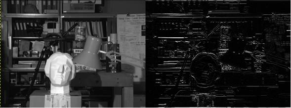

# Relatório Final - Sistemas Embarcados

> João Pedro Mazuco Rodriguez

> Johannes dos Reis

Este relatório apresenta uma comparação entre o MPSoCBench e o OVPsim. O MPSoCBench rodou na arquitetura ArchC interligados por uma rede noc.at. Já o OVPSim rodou em Open Risc 1000. Ambos os ambientes de simulação rodaram com paralelização em 4 processadores.

## Aplicação

A aplicação consistia na execução de uma convolução em uma imagem em grayscale. O kernel utilizado foi uma matriz 3x3, para detecção de bordas. O stride (ratio de deslizamento) foi de uma vez. A imagem utilizada foi de 130KB, devido a limitações de memória de embarcados. Tanto a imagem de entrada como de saída estão demonstradas na Figura 1. A escolha da convolução se deu pelo avanço da utilização de redes neurais convolucionais em algoritmos de segmentação, detecção de objetos e classificação. 

 

> Figura 1. Entrada e Saída do algoritmo de convolução com kernel para detecção de bordas.

 

## Resultados

Em termos comparativos, o MPSocBench e o OVPSim apresentaram os seguintes resultados, descritos na Tabela 1.

 

|                      | MPSoCBench - ARM | OVPSim – OR1K |
| -------------------- | ---------------- | ------------- |
| Tempo de Execução    | 52,67 segundos   | 0,05 segundos |
| Número de Instruções | 51,273,688       | 6.787.922     |

> Tabela 1. Comparativo tempos de execução

É notável que o tempo de execução de simulação no OVPSim em Open Risc 1000 é muito menor do que no MPSoCBench para processamento de imagens, performando 1000x mais rápido em tempo de execução e com 10x menos instruções.

Os valores obtidos nos terminais no final de cada execução foi: 

----------------- RELATÓRIO MPSoCBench ------------------

SystemC 2.3.1-Accellera --- Sep 25 2020 16:26:10

​    Copyright (c) 1996-2014 by all Contributors,

​    ALL RIGHTS RESERVED

 

ArchC: -------------------- Starting Simulation --------------------

 

MPSoCBench: The simulator is prepared.

MPSoCBench: Beggining of time simulation measurement.

 

Warning: (W536) immediate self-notification ignored as of IEEE 1666-2011: noc.thread_node

In file: sc_process.cpp:363

In process: noc.thread_node @ 100 ns

 

 

\--------------------------------------------------------------------

------------------------- MPSoCBench -----------------------------

-------------------- Running: convolution --------------------------

--------------- The results will be available in -------------------

--------------------- the output.pgm file --------------------------

\--------------------------------------------------------------------

 

 

Join Point->3 of 4 processors are not over yet...

Join Point->2 of 4 processors are not over yet...

Join Point->1 of 4 processors are not over yet...

 

ArchC: -------------------- Simulation Finished --------------------

 

ArchC: -------------------- Simulation Finished --------------------

 

ArchC: -------------------- Simulation Finished --------------------

 

ArchC: -------------------- Simulation Finished --------------------

 

Info: /OSCI/SystemC: Simulation stopped by user.

ArchC: Simulation statistics

  Times: 35.27 user, 17.11 system, 52.67 real

  Number of instructions executed: 5938873

  Simulation speed: 168.38 K instr/s

cache: IC

Cache statistics:

Read:  miss: 302875 (5.10012%) hit: 5635715 (94.8999%)

Write: miss: 0 (0%) hit: 0 (0%)

Number of block evictions: 39553

cache: DC

Cache statistics:

Read:  miss: 322917 (12.2781%) hit: 2307108 (87.7219%)

Write: miss: 12610 (1.89436%) hit: 653051 (98.1056%)

Number of block evictions: 83775

ArchC: Simulation statistics

  Times: 35.27 user, 17.11 system, 52.67 real

  Number of instructions executed: 12936026

  Simulation speed: 366.77 K instr/s

cache: IC

Cache statistics:

Read:  miss: 511243 (3.95209%) hit: 12424781 (96.0479%)

Write: miss: 0 (0%) hit: 0 (0%)

Number of block evictions: 13913

cache: DC

Cache statistics:

Read:  miss: 505471 (7.45391%) hit: 6275817 (92.5461%)

Write: miss: 6353 (6.24208%) hit: 95424 (93.7579%)

Number of block evictions: 21460

ArchC: Simulation statistics

  Times: 35.27 user, 17.11 system, 52.67 real

  Number of instructions executed: 19007061

  Simulation speed: 538.90 K instr/s

cache: IC

Cache statistics:

Read:  miss: 487290 (2.56373%) hit: 18519769 (97.4363%)

Write: miss: 0 (0%) hit: 0 (0%)

Number of block evictions: 16010

cache: DC

Cache statistics:

Read:  miss: 480377 (4.63552%) hit: 9882588 (95.3645%)

Write: miss: 6322 (6.40332%) hit: 92408 (93.5967%)

Number of block evictions: 22511

ArchC: Simulation statistics

  Times: 35.27 user, 17.11 system, 52.67 real

  Number of instructions executed: 13391728

  Simulation speed: 379.69 K instr/s

cache: IC

Cache statistics:

Read:  miss: 508924 (3.80029%) hit: 12882802 (96.1997%)

Write: miss: 0 (0%) hit: 0 (0%)

Number of block evictions: 13777

cache: DC

Cache statistics:

Read:  miss: 503471 (7.13922%) hit: 6548713 (92.8608%)

Write: miss: 5982 (6.13199%) hit: 91572 (93.868%)

Number of block evictions: 21706

 

Total Time Taken (seconds): 52.667774

Simulation advance (seconds): 1.038771

MPSoCBench: Ending the time simulation measurement.

 

Total Number of Packages:  9290234

Total Number of Hops: 54831696

Average Number of Hops per package: 5

Memory Reads: 7307670 

Memory Writes: 1927444

\--------------------------------------------------------

 

 

 

------------------ RELATÓRIO OVPSIM ---------------------

processor0 has executed 1687300 instructions

processor1 has executed 1700207 instructions

processor2 has executed 1700208 instructions

processor3 has executed 1700207 instructions

Info

Info ---------------------------------------------------

Info CPU 'cpu3' STATISTICS

Info  Type         : or1k

Info  Nominal MIPS     : 100

Info  Final program counter : 0x229c

Info  Simulated instructions: 1,700,207

Info  Simulated MIPS    : run too short for meaningful result

Info ---------------------------------------------------

Info

Info ---------------------------------------------------

Info CPU 'cpu2' STATISTICS

Info  Type         : or1k

Info  Nominal MIPS     : 100

Info  Final program counter : 0x229c

Info  Simulated instructions: 1,700,208

Info  Simulated MIPS    : run too short for meaningful result

Info ---------------------------------------------------

Info

Info ---------------------------------------------------

Info CPU 'cpu1' STATISTICS

Info  Type         : or1k

Info  Nominal MIPS     : 100

Info  Final program counter : 0x229c

Info  Simulated instructions: 1,700,207

Info  Simulated MIPS    : run too short for meaningful result

Info ---------------------------------------------------

Info

Info ---------------------------------------------------

Info CPU 'cpu0' STATISTICS

Info  Type         : or1k

Info  Nominal MIPS     : 100

Info  Final program counter : 0x229c

Info  Simulated instructions: 1,687,300

Info  Simulated MIPS    : run too short for meaningful result

Info ---------------------------------------------------

Info

Info ---------------------------------------------------

Info TOTAL

Info  Simulated instructions: 6,787,922

Info  Simulated MIPS    : run too short for meaningful result

Info ---------------------------------------------------

Info

Info ---------------------------------------------------

Info SIMULATION TIME STATISTICS

Info  Simulated time    : 0.02 seconds

Info  User time       : 0.03 seconds

Info  System time      : 0.00 seconds

Info  Elapsed time     : 0.05 seconds

Info ---------------------------------------------------